# Quick Start Guide - CoLD Case Analyzer

This guide provides a quick overview of how to get started with the CoLD Case Analyzer Streamlit application.

## System Overview

The CoLD Case Analyzer is a Streamlit web application for analyzing court decisions related to private international law (PIL). The system provides an interactive interface for step-by-step case analysis with AI assistance.

```mermaid
graph TB
    User[Legal Analyst/Researcher]

    subgraph "CoLD Case Analyzer"
        WebApp[🌐 Streamlit Web Application]
    end

    subgraph "Key Features"
        Interactive[Interactive Analysis<br/>Step-by-step Workflow]
        Validation[User Validation<br/>Edit & Score Results]
        Storage[Database Storage<br/>Save Analyses]
    end

    User --> WebApp
    WebApp --> Interactive
    WebApp --> Validation
    WebApp --> Storage

    classDef app fill:#e3f2fd,stroke:#1976d2,stroke-width:2px
    classDef feature fill:#f3e5f5,stroke:#7b1fa2,stroke-width:2px

    class WebApp app
    class Interactive,Validation,Storage feature
```



## Quick Setup

### Prerequisites

- Python 3.12+
- OpenAI API Key

### Installation Steps

1. **Clone the repository**:

```bash
git clone https://github.com/Choice-of-Law-Dataverse/cold-case-analysis.git
cd cold-case-analysis
```

2. **Set up environment**:

```bash
# Copy environment template
cp .env.example .env

# Edit .env and add your API key
# Required: OPENAI_API_KEY=your_key_here
```

3. **Install dependencies**:

Using pip:

```bash
pip install streamlit langchain-core langchain-openai pandas pymupdf4llm psycopg2-binary python-dotenv requests
```

Or using uv (recommended):

```bash
uv sync
```

4. **Run the application**:

```bash
# With pip installation
cd src
streamlit run app.py

# With uv
uv run streamlit run src/app.py
```

5. **Open browser**: Navigate to `http://localhost:8501`

## Using the Application

### Demo Case

The easiest way to try the application:

1. Open the application at `http://localhost:8501`
2. Click **"Use Demo Case"** button
3. The BGE 132 III 285 Swiss court case will be loaded
4. Click **"Detect Jurisdiction"** to start the analysis
5. Follow the workflow, reviewing and scoring each step

### Analyzing Your Own Case

1. **Enter Case Citation**:

   - Required field
   - Example: "Federal Court, 20.12.2005 - BGE 132 III 285"
   - Include court, parties, case number, and date

2. **Provide Court Decision Text**:

   - Option A: Upload PDF file
   - Option B: Paste text directly into the text area

3. **Start Analysis**:

   - Click "Detect Jurisdiction" to begin
   - The system will identify the legal system (Civil Law, Common Law, or Indian)

4. **Review Each Step**:

   - **Jurisdiction Detection**: Confirm or correct the identified jurisdiction
   - **COL Extraction**: Review extracted Choice of Law sections
   - **Theme Classification**: Validate PIL theme categorization
   - **PIL Provisions**: Review extracted provisions
   - **Detailed Analysis**: Review comprehensive legal analysis

5. **Provide Feedback**:
   - Score each step (0-100)
   - Edit results as needed
   - Provide specific feedback for refinement

### Optional: Save to Database

If you've configured `SQL_CONN_STRING` in your `.env` file, analyses will be automatically saved to the PostgreSQL database with:

- User identification
- Model information
- Timestamps
- Complete analysis results

## Analysis Workflow

The application follows this analysis pattern:

```mermaid
flowchart LR
    Input[📄 Court Decision] --> Jurisdiction[🏛️ Detect Jurisdiction]
    Jurisdiction --> COL[📝 Extract COL Section]
    COL --> Theme[🏷️ Classify Theme]
    Theme --> Analysis[🔍 Complete Analysis]
    Analysis --> Output[📊 Structured Results]

    subgraph "Analysis Components"
        Abstract[Abstract]
        Facts[Relevant Facts]
        Provisions[PIL Provisions]
        Issue[COL Issue]
        Position[Court Position]
    end

    Analysis --> Abstract
    Analysis --> Facts
    Analysis --> Provisions
    Analysis --> Issue
    Analysis --> Position

    classDef process fill:#e3f2fd,stroke:#1976d2
    classDef component fill:#f3e5f5,stroke:#7b1fa2

    class Input,Jurisdiction,COL,Theme,Analysis,Output process
    class Abstract,Facts,Provisions,Issue,Position component
```



## Sample Input/Output

### Input: Court Decision Text

```
Federal Court, 20.12.2005 - BGE 132 III 285
...Swiss Federal Supreme Court decision regarding FIFA rules and choice of law...
```

### Output: Structured Analysis

```json
{
  "Abstract": "Article 116 of the Swiss Private International Law Act (PILA); admissibility of choice of law...",
  "Relevant Facts": "The case involves X. AG, a company based in St. Gallen, Switzerland...",
  "PIL Provisions": ["Art. 116 PILA", "Art. 129 CO"],
  "Theme": ["Non-State law (rules of law)"],
  "Choice of Law Issue": "Can parties choose non-state rules, such as those established by private organizations...",
  "Court Position": "The court's position on the choice of law issue under Article 116..."
}
```

## Validation & Testing

### Basic Validation

```bash
# Test Python environment
python --version  # Should show Python 3.12+

# Test imports from src directory
cd src
python -c "import streamlit; print('✓ Streamlit works')"
python -c "from components.input_handler import render_input_phase; print('✓ App imports work')"
```

### Demo Case Testing

1. Open the web application
2. Click "Use Demo Case" to load BGE 132 III 285
3. Follow the workflow to test all features

### Run Tests

```bash
cd src
pytest tests/ -v
```

## Troubleshooting

### Common Issues

1. **Module Import Errors**

   ```bash
   # Make sure you're in the src/ directory
   cd src
   streamlit run app.py
   ```

2. **Missing API Key**

   ```bash
   # Check .env file in repository root
   cat ../.env | grep OPENAI_API_KEY
   ```

3. **Missing Dependencies**

   ```bash
   # Install all required packages
   pip install streamlit langchain-core langchain-openai pandas pymupdf4llm psycopg2-binary python-dotenv requests
   ```

4. **PDF Upload Not Working**

   - Ensure `pymupdf4llm` is installed
   - Check PDF file is not encrypted or corrupted

5. **Database Connection Issues**
   - Verify `SQL_CONN_STRING` format in `.env`
   - Database persistence is optional - app works without it

## Configuration Options

### Environment Variables

Required:

- `OPENAI_API_KEY`: Your OpenAI API key

Optional:

- `OPENAI_MODEL`: Model to use (default: "gpt-5-nano")
- `SQL_CONN_STRING`: PostgreSQL connection string
- `USER_CREDENTIALS`: JSON for authentication (e.g., `{"admin":"password"}`)

### Model Selection

Different models available based on authentication:

- **Guest users**: Limited to basic models
- **Authenticated users**: Access to advanced models

Configure authentication in `.env`:

```bash
USER_CREDENTIALS='{"username":"password","admin":"admin123"}'
```

## Next Steps

- **Explore Documentation**: Review detailed architecture and workflow documentation
  - [Architecture Documentation](ARCHITECTURE.md)
  - [Workflows Documentation](WORKFLOWS.md)
  - [Agent Documentation](agent.md)
- **Customize Prompts**: Edit jurisdiction-specific prompts in `src/prompts/`
- **Review Themes**: Check `src/data/themes.csv` for PIL theme taxonomy
- **Database Integration**: Set up PostgreSQL for persistent storage

## Support

For issues and questions:

- Review comprehensive documentation in the `docs/` folder
- Check existing GitHub repository issues
- Consult the [CoLD project website](https://cold.global/) for research context
