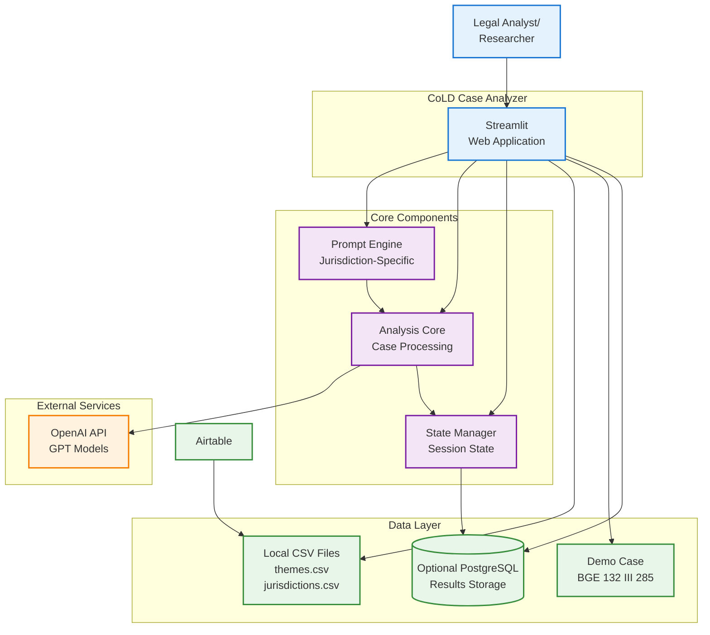
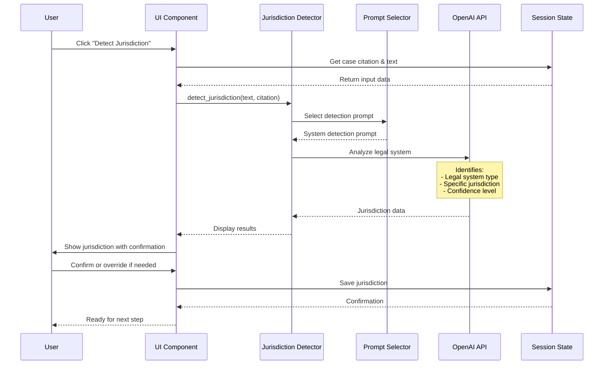
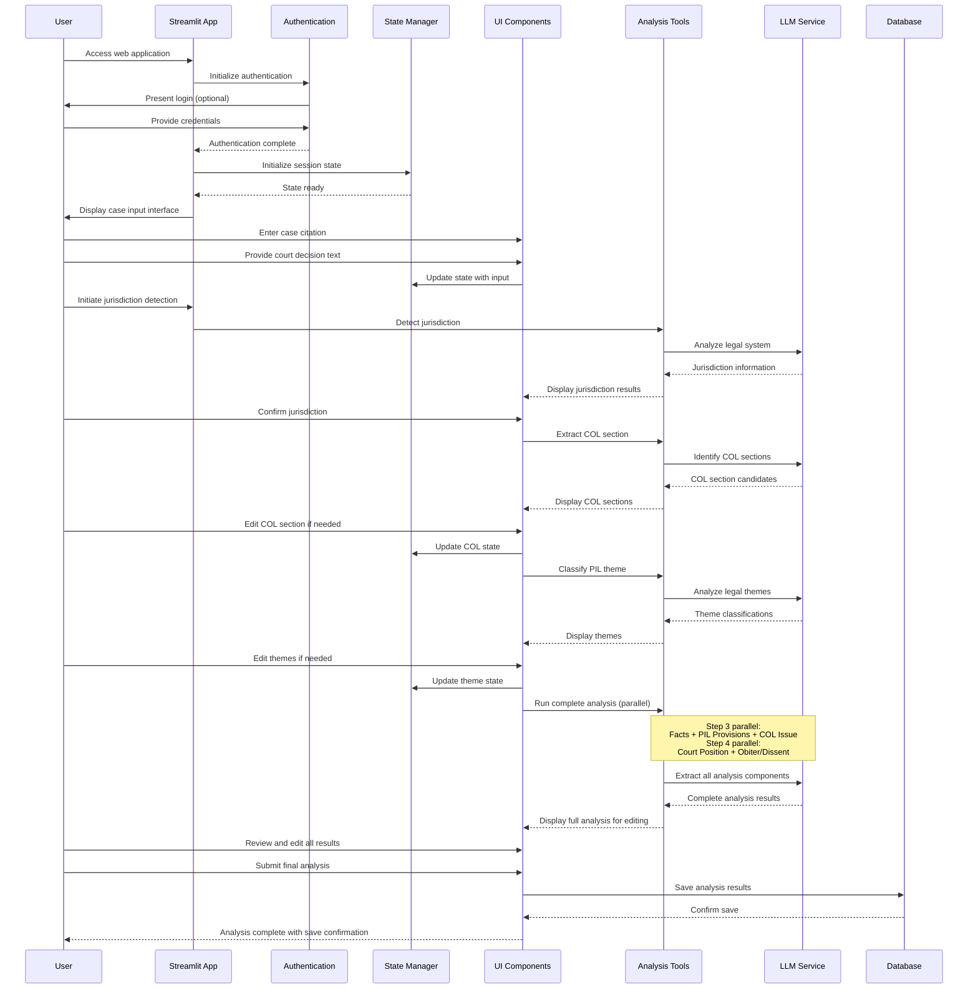
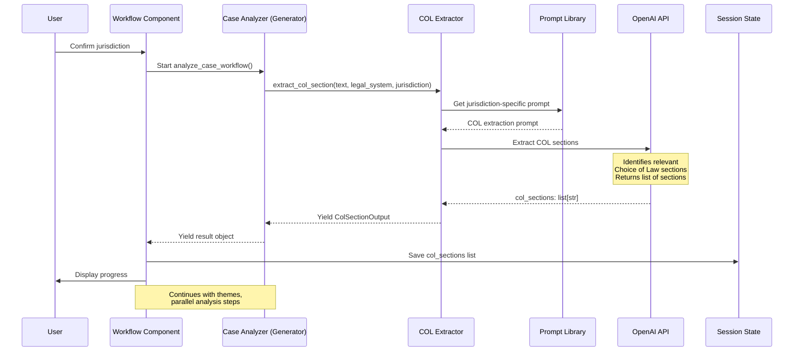
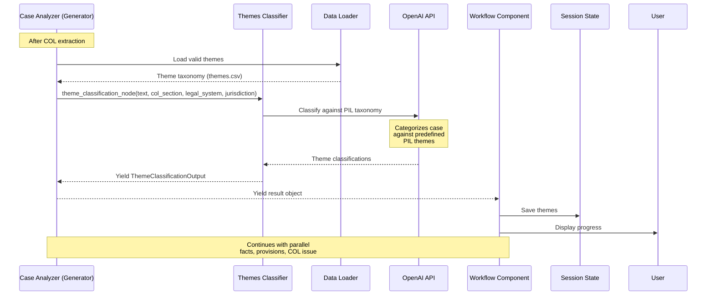
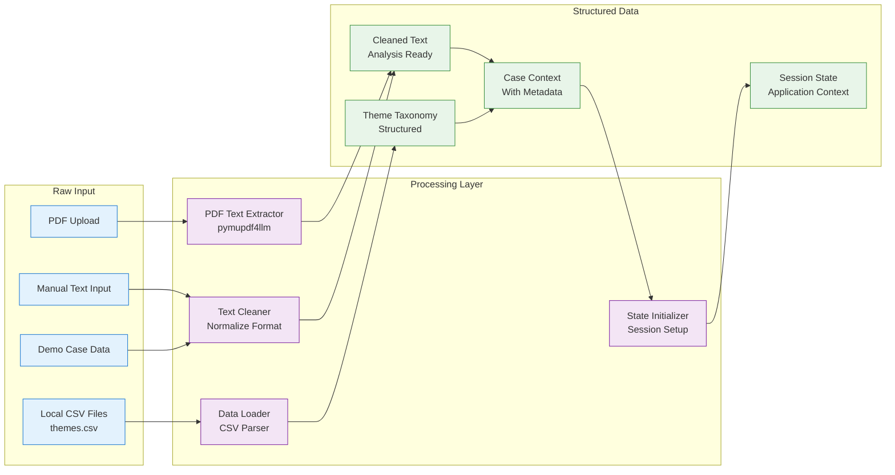
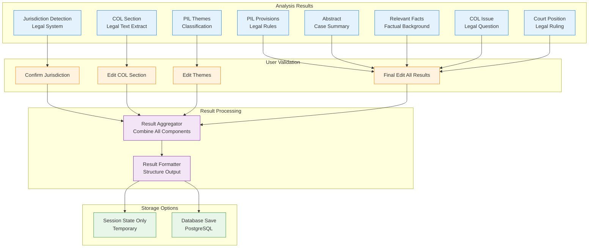

# CoLD Case Analyzer - Workflow Documentation

This document provides detailed workflow diagrams and data flow patterns for the CoLD Case Analyzer Streamlit application.

## High-Level System Overview

## Complete Analysis Workflow

This diagram shows the end-to-end analysis process with the new automated generator-based workflow:

```mermaid
flowchart TD
    Start([User Opens Application])

    subgraph "Input Phase"
        Citation[Enter Case Citation<br/>Required]
        InputSource{Choose Input Method}
        TextInput[Paste Court Decision Text<br/>Direct Input]
        PDFUpload[Upload PDF<br/>Automatic Extraction]
        DemoLoad[Use Demo Case<br/>BGE 132 III 285]
        EmailOpt[Optional Email<br/>Contact Info]
    end

    subgraph "Jurisdiction Detection"
        DetectJuris[Detect Legal System<br/>Civil Law/Common Law/India]
        DisplayJuris[Display Jurisdiction<br/>Results]
        ConfirmJuris[✓ User Confirms<br/>ONLY MANUAL STEP]
    end

    subgraph "Automated Analysis Workflow"
        StartGen[Start Generator Workflow<br/>analyze_case_workflow]

        subgraph "Step 1"
            ExtractCOL[Extract COL Sections<br/>Returns list of sections]
        end

        subgraph "Step 2"
            ClassifyTheme[Classify PIL Themes<br/>Against Taxonomy]
        end

        subgraph "Step 3 - Parallel Execution"
            Facts[Extract Relevant Facts]
            Provisions[Extract PIL Provisions]
            Issue[Identify COL Issue]
        end

        subgraph "Step 4 - Parallel Execution"
            Position[Extract Court Position]
            CommonLaw{Common Law?}
            ObiterDicta[Extract Obiter Dicta<br/>Common Law Only]
            DissentOps[Extract Dissenting Opinions<br/>Common Law Only]
        end

        subgraph "Step 5"
            Abstract[Generate Abstract<br/>Final Summary]
        end
    end

    subgraph "Review & Edit"
        ReviewAll[Review Complete Analysis<br/>Edit ALL Results]
        EditThemes[Edit Themes<br/>Multiselect]
        EditCOL[Edit COL Sections<br/>Textarea]
        EditOther[Edit Other Steps<br/>Facts, Issue, Position, etc.]
        SaveDB[Save to Database<br/>Optional PostgreSQL]
        Complete[Analysis Complete<br/>Display Summary]
    end

    End([User Completes Session])

    %% Flow connections
    Start --> Citation
    Citation --> EmailOpt
    EmailOpt --> InputSource

    InputSource --> TextInput
    InputSource --> PDFUpload
    InputSource --> DemoLoad

    TextInput --> DetectJuris
    PDFUpload --> DetectJuris
    DemoLoad --> DetectJuris

    DetectJuris --> DisplayJuris
    DisplayJuris --> ConfirmJuris
    ConfirmJuris --> StartGen

    StartGen --> ExtractCOL
    ExtractCOL --> ClassifyTheme
    ClassifyTheme --> Facts
    ClassifyTheme --> Provisions
    ClassifyTheme --> Issue

    Facts --> Position
    Provisions --> Position
    Issue --> Position

    Position --> CommonLaw
    CommonLaw -->|Yes| ObiterDicta
    CommonLaw -->|Yes| DissentOps
    CommonLaw -->|No| Abstract
    ObiterDicta --> Abstract
    DissentOps --> Abstract

    Abstract --> ReviewAll
    ReviewAll --> EditThemes
    ReviewAll --> EditCOL
    ReviewAll --> EditOther
    EditThemes --> SaveDB
    EditCOL --> SaveDB
    EditOther --> SaveDB
    SaveDB --> Complete
    Complete --> End

    classDef start fill:#e8f5e9,stroke:#388e3c,stroke-width:3px
    classDef input fill:#e3f2fd,stroke:#1976d2,stroke-width:2px
    classDef process fill:#f3e5f5,stroke:#7b1fa2,stroke-width:2px
    classDef decision fill:#fff3e0,stroke:#f57c00,stroke-width:2px
    classDef automated fill:#b3e5fc,stroke:#0277bd,stroke-width:2px
    classDef output fill:#fce4ec,stroke:#c2185b,stroke-width:2px

    class Start,End start
    class Citation,EmailOpt,InputSource,TextInput,PDFUpload,DemoLoad input
    class DetectJuris,DisplayJuris process
    class ConfirmJuris decision
    class StartGen,ExtractCOL,ClassifyTheme,Facts,Provisions,Issue,Position,CommonLaw,ObiterDicta,DissentOps,Abstract automated
    class ReviewAll,EditThemes,EditCOL,EditOther,SaveDB,Complete output
```

## Detailed Component Workflows

### Jurisdiction Detection Workflow

### Streamlit Application Detailed Workflow

### COL Extraction Workflow

### Theme Classification Workflow

## Data Processing Patterns

### Input Data Transformation

### Result Generation and Storage Pipeline

## Summary

This workflow documentation provides a comprehensive overview of the CoLD Case Analyzer's operational processes:

- **Main Workflow**: Generator-based automated analysis from jurisdiction confirmation to completion
- **Component Workflows**: Jurisdiction detection, COL extraction, and theme classification
- **Data Processing**: Input transformation and result storage patterns

### Current Implementation

**Generator-Based Workflow:**

- All analysis steps after jurisdiction confirmation are automated
- Uses `analyze_case_workflow()` generator function that yields result objects
- User confirms jurisdiction only; all other steps run automatically

**Parallel Execution:**

- Step 3: Facts + PIL Provisions + COL Issue (3 parallel operations)
- Step 4: Court Position + Obiter Dicta + Dissenting Opinions (up to 3 parallel operations for Common Law)

**Parameter Naming:**

- `legal_system`: Type of legal system (e.g., "Civil-law jurisdiction", "Common-law jurisdiction")
- `jurisdiction`: Specific jurisdiction (e.g., "Switzerland", "United States", "India")
- `themes`: Classified PIL themes

**ColSectionOutput Model:**

- Returns `col_sections: list[str]` supporting multiple Choice of Law sections
- Sections are joined with double newlines for processing

**Workflow Steps:**

1. **COL Section Extraction**: Yields `ColSectionOutput` with list of sections
2. **Theme Classification**: Yields `ThemeClassificationOutput` with themes list
3. **Parallel Analysis Step 1**: Yields `RelevantFactsOutput`, `PILProvisionsOutput`, and `ColIssueOutput` in parallel
4. **Parallel Analysis Step 2**: Yields `CourtsPositionOutput`, and for Common Law: `ObiterDictaOutput` and `DissentingOpinionsOutput` in parallel
5. **Abstract**: Yields `AbstractOutput` synthesizing all previous steps

**Final Editing Phase:**

- User can edit all results including themes, COL sections, and all analysis steps
- Single comprehensive review before saving
