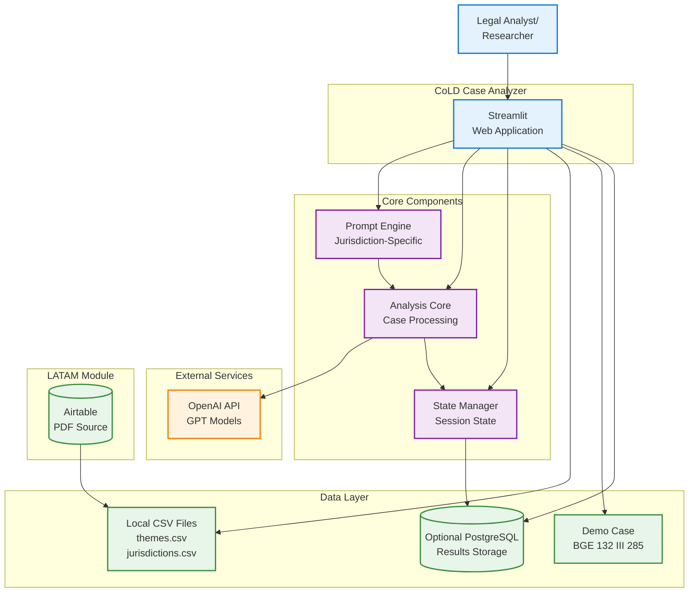
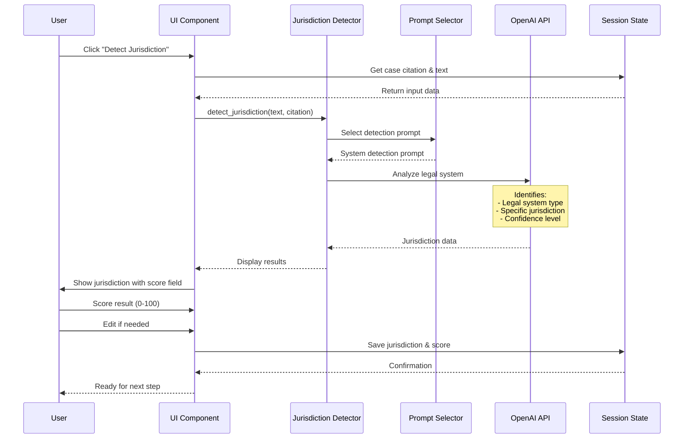
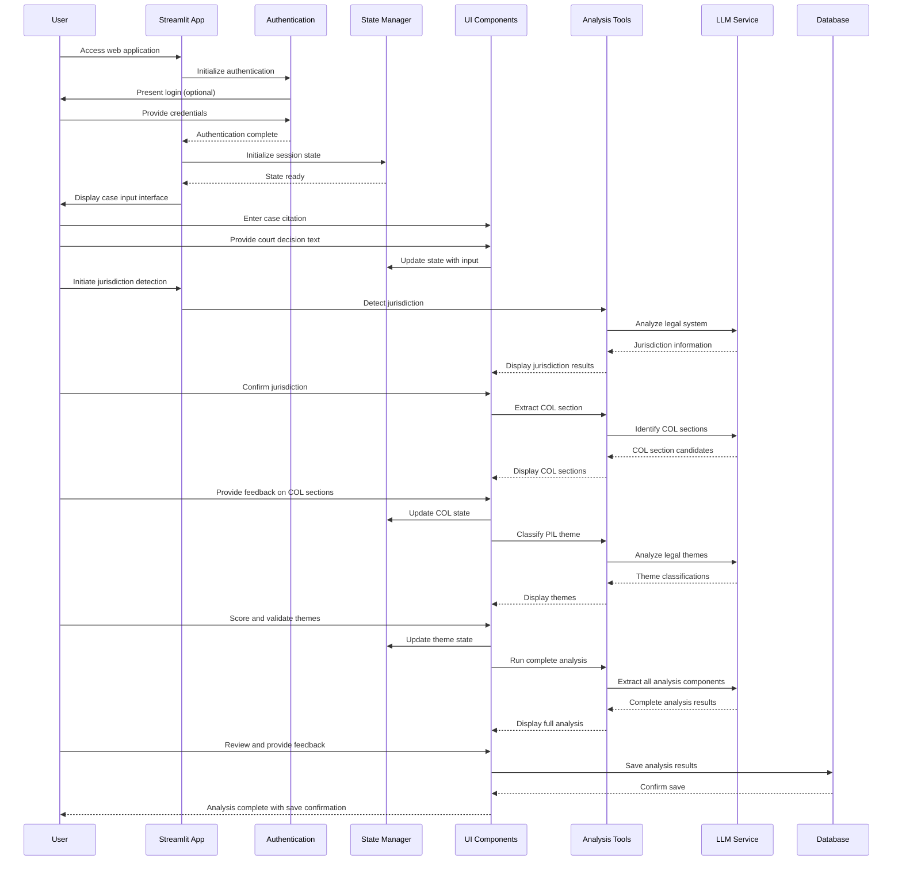
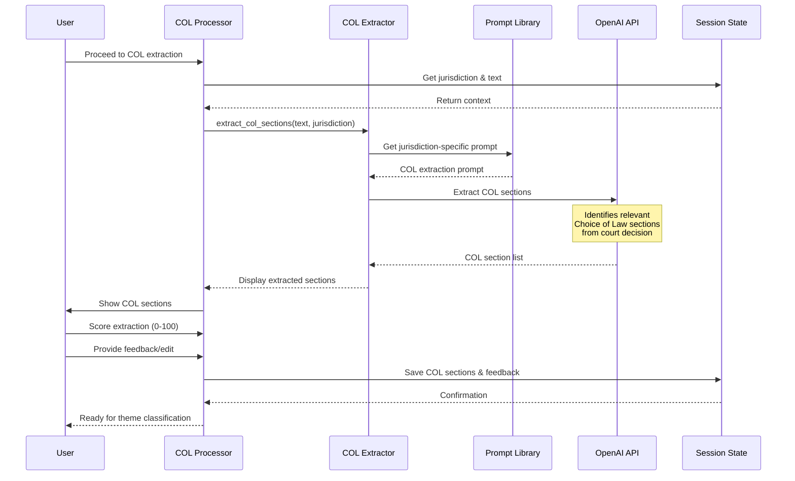
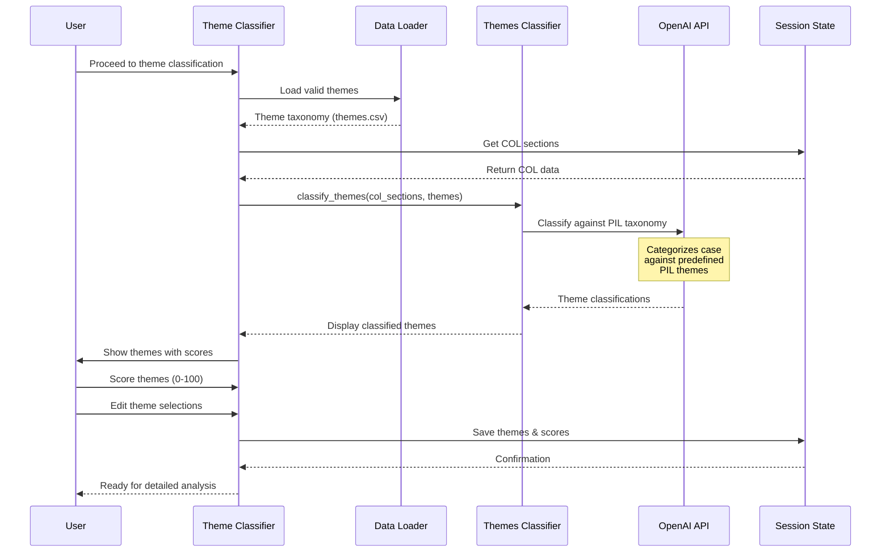
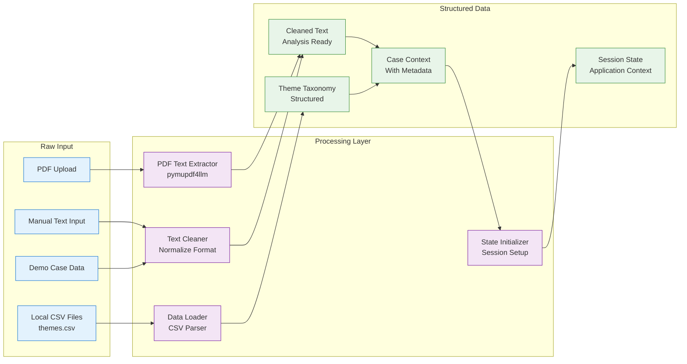
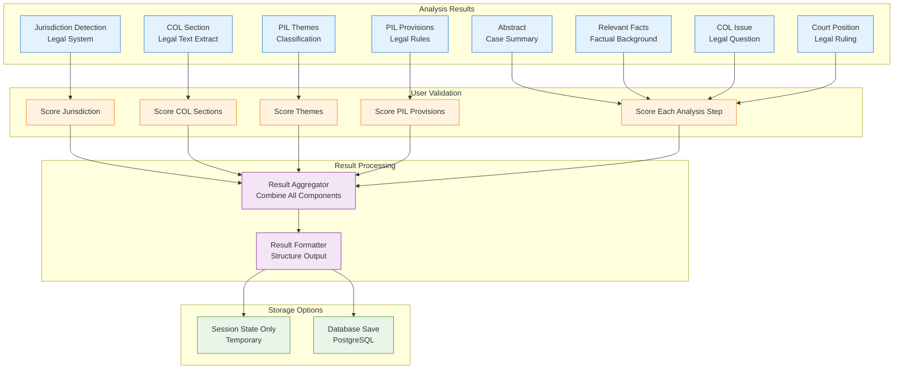

# CoLD Case Analyzer - Workflow Documentation

This document provides detailed workflow diagrams and data flow patterns for the CoLD Case Analyzer Streamlit application.

## High-Level System Overview

## Complete Analysis Workflow

This diagram shows the end-to-end analysis process from input to final results:

```mermaid
flowchart TD
    Start([User Opens Application])
    
    subgraph "Input Phase"
        Citation[Enter Case Citation<br/>Required]
        InputSource{Choose Input Method}
        TextInput[Paste Court Decision Text<br/>Direct Input]
        PDFUpload[Upload PDF<br/>Automatic Extraction]
        DemoLoad[Use Demo Case<br/>BGE 132 III 285]
        EmailOpt[Optional Email<br/>Contact Info]
    end
    
    subgraph "Jurisdiction Detection"
        DetectJuris[Detect Legal System<br/>Civil Law/Common Law/India]
        DisplayJuris[Display Jurisdiction<br/>Results]
        ScoreJuris[User Scores Result<br/>0-100]
        EditJuris[Edit if Needed<br/>Manual Correction]
    end
    
    subgraph "COL Section Extraction"
        ExtractCOL[Extract COL Sections<br/>Identify Relevant Text]
        DisplayCOL[Display Extracted<br/>Sections]
        ScoreCOL[User Scores Extraction<br/>0-100]
        FeedbackCOL[Provide Feedback<br/>Edit/Refine]
    end
    
    subgraph "Theme Classification"
        ClassifyTheme[Classify PIL Themes<br/>Against Taxonomy]
        DisplayThemes[Display Classified<br/>Themes]
        ScoreThemes[User Scores Themes<br/>0-100]
        EditThemes[Edit Theme List<br/>Manual Adjustment]
    end
    
    subgraph "PIL Provisions"
        ExtractPIL[Extract PIL Provisions<br/>Legal Rules]
        DisplayPIL[Display Provisions]
        ScorePIL[User Scores<br/>0-100]
    end
    
    subgraph "Detailed Analysis Steps"
        Abstract[1. Extract Abstract<br/>Case Summary]
        Facts[2. Extract Relevant Facts<br/>Factual Background]
        Provisions[3. Identify PIL Provisions<br/>Applicable Rules]
        Issue[4. Identify COL Issue<br/>Legal Question]
        Position[5. Extract Court Position<br/>Court's Reasoning]
    end
    
    subgraph "Review & Save"
        ReviewAll[Review Complete Analysis<br/>All Components]
        SaveDB[Save to Database<br/>Optional PostgreSQL]
        Complete[Analysis Complete<br/>Display Summary]
    end
    
    End([User Completes Session])
    
    %% Flow connections
    Start --> Citation
    Citation --> EmailOpt
    EmailOpt --> InputSource
    
    InputSource --> TextInput
    InputSource --> PDFUpload
    InputSource --> DemoLoad
    
    TextInput --> DetectJuris
    PDFUpload --> DetectJuris
    DemoLoad --> DetectJuris
    
    DetectJuris --> DisplayJuris
    DisplayJuris --> ScoreJuris
    ScoreJuris --> EditJuris
    EditJuris --> ExtractCOL
    
    ExtractCOL --> DisplayCOL
    DisplayCOL --> ScoreCOL
    ScoreCOL --> FeedbackCOL
    FeedbackCOL --> ClassifyTheme
    
    ClassifyTheme --> DisplayThemes
    DisplayThemes --> ScoreThemes
    ScoreThemes --> EditThemes
    EditThemes --> ExtractPIL
    
    ExtractPIL --> DisplayPIL
    DisplayPIL --> ScorePIL
    ScorePIL --> Abstract
    
    Abstract --> Facts
    Facts --> Provisions
    Provisions --> Issue
    Issue --> Position
    
    Position --> ReviewAll
    ReviewAll --> SaveDB
    SaveDB --> Complete
    Complete --> End

    classDef start fill:#e8f5e9,stroke:#388e3c,stroke-width:3px
    classDef input fill:#e3f2fd,stroke:#1976d2,stroke-width:2px
    classDef process fill:#f3e5f5,stroke:#7b1fa2,stroke-width:2px
    classDef decision fill:#fff3e0,stroke:#f57c00,stroke-width:2px
    classDef output fill:#fce4ec,stroke:#c2185b,stroke-width:2px

    class Start,End start
    class Citation,EmailOpt,InputSource,TextInput,PDFUpload,DemoLoad input
    class DetectJuris,DisplayJuris,ExtractCOL,DisplayCOL,ClassifyTheme,DisplayThemes,ExtractPIL,DisplayPIL,Abstract,Facts,Provisions,Issue,Position process
    class ScoreJuris,EditJuris,ScoreCOL,FeedbackCOL,ScoreThemes,EditThemes,ScorePIL decision
    class ReviewAll,SaveDB,Complete output
```

## Detailed Component Workflows

### Jurisdiction Detection Workflow

### Streamlit Application Detailed Workflow

### COL Extraction Workflow

### Theme Classification Workflow

## Data Processing Patterns

### Input Data Transformation

### Result Generation and Storage Pipeline

## Summary

This workflow documentation provides a comprehensive overview of the CoLD Case Analyzer's operational processes:

- **Main Workflow**: Step-by-step user-guided analysis from input to completion
- **Component Workflows**: Detailed flows for jurisdiction detection, COL extraction, and theme classification
